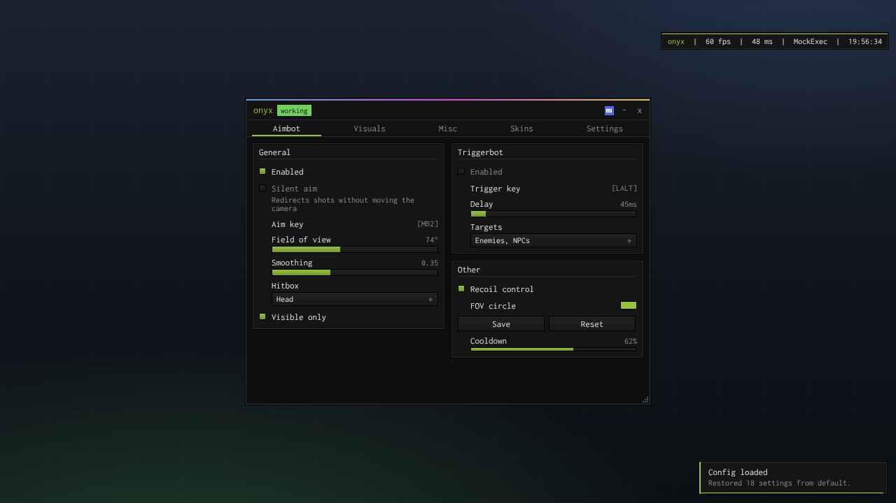
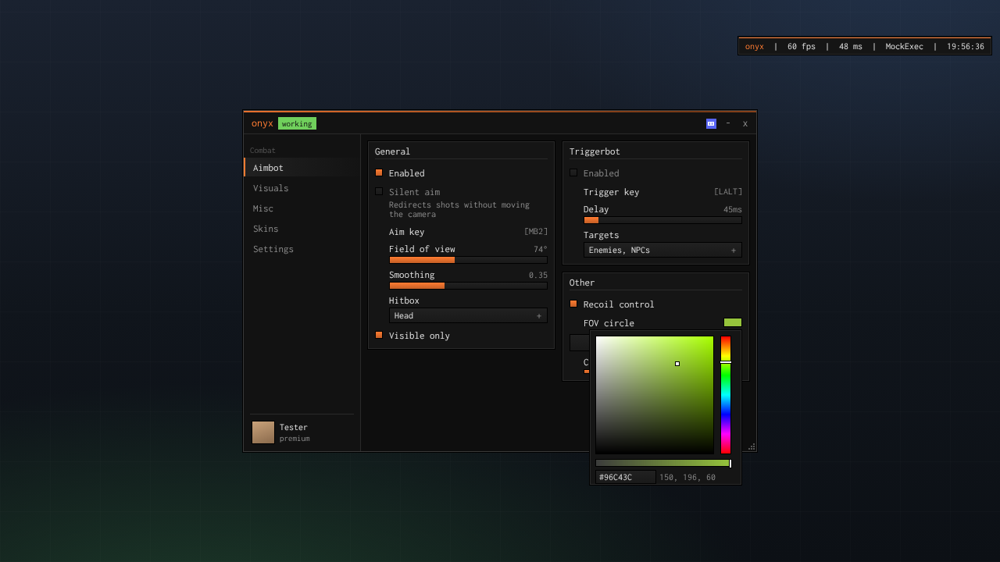
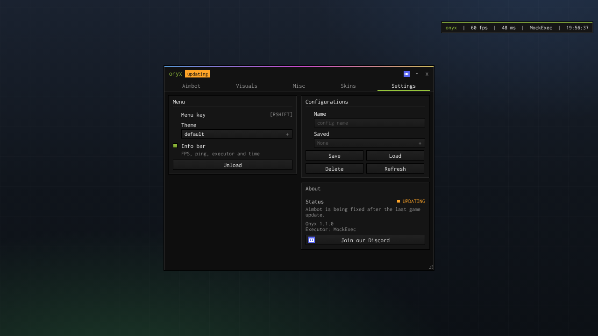
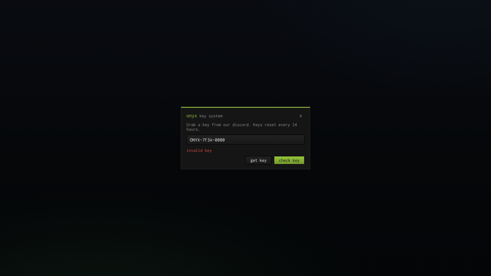
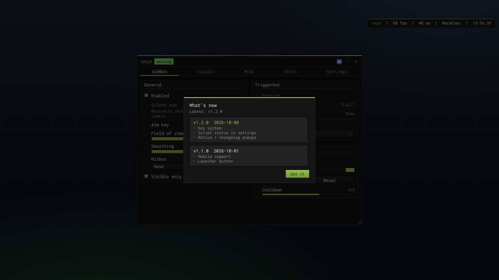

# onyx

A Roblox UI library styled after old CS cheat menus. Black pixel borders, rainbow bar on top, two-column group boxes, monospace everything. Works on PC and mobile.



```lua
local Onyx = loadstring(game:HttpGet("https://raw.githubusercontent.com/onyxuilibrary/onyx-ui/main/source.lua"))()
```

## Example

```lua
local Onyx = loadstring(game:HttpGet("https://raw.githubusercontent.com/onyxuilibrary/onyx-ui/main/source.lua"))()

local window = Onyx:CreateWindow({
	name = "onyx",
	subtitle = "my hub",
	status = "working",
	configuration = { fileName = "my-hub" },
})

local tab = window:CreateTab({ name = "Aimbot" })
local general = tab:CreateSection("General")

general:CreateToggle({
	name = "Enabled",
	callback = function(on)
		print("enabled:", on)
	end,
})

general:CreateSlider({
	name = "Field of view",
	range = { 0, 180 },
	value = 90,
	suffix = "°",
	callback = function(value)
		print("fov:", value)
	end,
})
```

RightShift opens and closes the menu on PC. On mobile there's a small button on the side of the screen you can tap (and drag out of the way).

There's a bigger example covering everything in [example.lua](example.lua).

## What's in it

- toggles, buttons, sliders, dropdowns (multi select + search), inputs, keybinds (with hold mode), colour pickers, stats, progress bars, consoles, text and dividers
- group boxes that fill two columns, row/column groups for putting things side by side
- top tabs or a sidebar with your avatar
- config saving with autosave/autoload and named configs
- 6 themes plus custom ones, all switchable live
- key system
- script status (working / updating / patched) shown in the header and settings. Point it at a text file and you can flip it to patched without updating your script, see [status](docs/status.md)
- notice and changelog popups when the script runs
- info bar with fps, ping, executor and the time
- discord button with the discord logo (copies the invite and opens it in discord)
- notifications, toasts and popups
- a settings tab with menu key, theme, configs and unload built in
- mobile: launcher button, scales to fit the screen, multi-touch safe sliders

## Screenshots

| | |
|---|---|
|  |  |
| sidebar layout, ember theme, colour picker | settings tab with script status |
|  |  |
| key system | changelog on execute |


*phone in landscape, the `onyx` button on the left toggles the menu*

These are rendered from the library's real layout using the test runtime in `tests/`, so spacing and colours match. In game the text is drawn by Roblox, so it can look a tiny bit different.

## Docs

- [Getting started](docs/getting-started.md)
- [Window](docs/window.md)
- [Tabs, sections and groups](docs/layout.md)
- [Elements](docs/elements.md)
- [Notifications, popups, notice and changelog](docs/messages.md)
- [Key system](docs/key-system.md)
- [Script status](docs/status.md)
- [Saving and flags](docs/saving.md)
- [Themes](docs/themes.md)
- [Mobile](docs/mobile.md)

## Tests

`tests/` has a mock of the Roblox engine. It's strict, so a bad property name, wrong value type or invalid enum errors the same way it would in game. The suite clicks, drags, types and taps through every element, about 380 checks.

```
cd tests
npm install
npm test
```

## License

MIT
