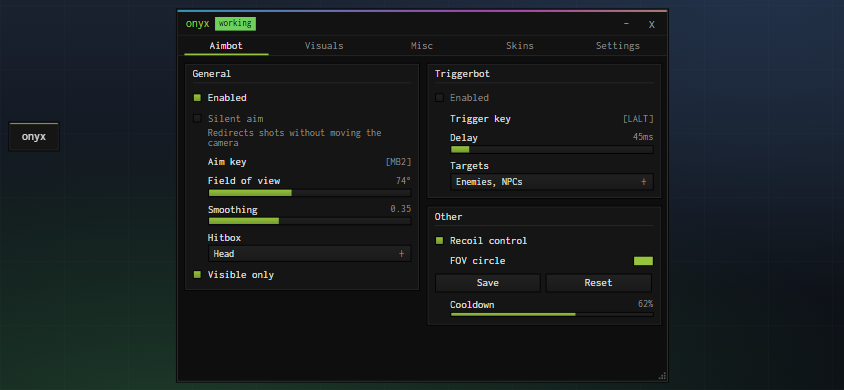

# Mobile

You don't need to do anything, phones and tablets get detected (touch, no mouse) and the UI adjusts.



## What changes

- **launcher button**: the small `onyx` button on the left side of the screen. Tap it to open/close the menu, drag it if it's in the way. It stays on screen the whole time since there's no keyboard to press RightShift on. On PC the same button only shows up while the menu is hidden.
- **scaling**: the window shrinks to fit the screen and refits when you rotate the phone. Dropdown lists and the colour picker scale with it, popups and the key prompt shrink if the screen is too narrow.
- **touch dragging**: sliders, the colour picker and the window follow the finger that started the drag. Your other thumb on the movement stick won't grab a slider by accident, and the page doesn't scroll while you're dragging a slider.
- **bigger targets**: header buttons, dropdown rows and slider hit areas are larger.
- the "hidden" message says to tap the button instead of naming a key.

## Options

```lua
Onyx:CreateWindow({
	name = "hub",
	mobile = true,      -- force mobile mode (or false to force pc mode)
	scale = 0.8,        -- fixed scale instead of auto fit
	showName = "menu",  -- launcher text
	showIcon = 123,     -- launcher icon
	showIconOnly = true,
	showPill = false,   -- no launcher at all (careful, mobile players can't reopen it then)
})
```
